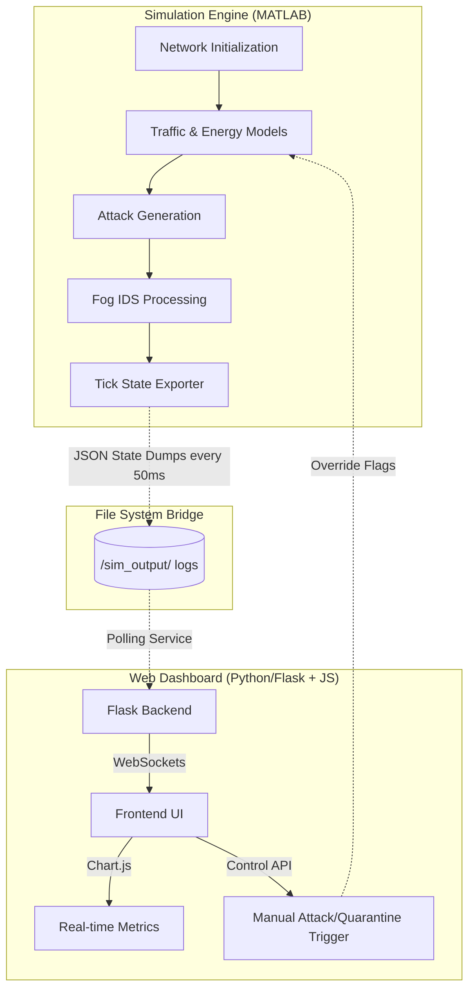

# Hospital Fog Intrusion Detection System (IDS) - Project Report

## 1. Abstract
The rapid proliferation of Internet of Medical Things (IoMT) devices in modern healthcare environments introduces significant cybersecurity vulnerabilities. This project presents a comprehensive, real-time Intrusion Detection System (IDS) designed specifically for a simulated 1,481-node hospital fog network. By leveraging a dual-stack architecture comprising a MATLAB-based high-performance simulation engine and a Python/Flask web dashboard, the system effectively models complex medical device interactions across segmented VLANs. The core of the IDS relies on a lightweight, 7-module statistical machine learning ensemble deployed at the fog layer. This ensemble analyzes packet rates, communication latency, payload entropy, and physiological data integrity to detect various cyber threats, including DDoS, Man-in-the-Middle (MITM), Replay Attacks, Nmap (Port Scanning), Advanced Persistent Threats (APT), and Data Injection. The results demonstrate a highly responsive, resource-efficient detection mechanism capable of real-time monitoring and threat mitigation in critical healthcare infrastructures.

### 2. Project Description
Modern hospitals rely heavily on interconnected medical devices to provide continuous, life-saving care. However, the constrained computational resources of these Internet of Medical Things (IoMT) devices make them prime targets for cyberattacks. Traditional cloud-based security solutions introduce unacceptable latency and bandwidth bottlenecks for real-time medical applications.

To address this, this project develops a **Fog Computing-based Intrusion Detection System**. By pushing processing and machine learning analytics closer to the edge devices (into the "Fog"), the system achieves real-time threat detection and mitigation without overwhelming the cloud. 

The project accurately simulates a large-scale hospital environment, consisting of exactly **1,481 network nodes** spread across a $500m \times 400m$ facility. The simulation comprehensively models:
- **Diverse Clinical Wards:** ICU, General Ward, Pharmacy, Radiology, Facility, and Guest areas.
- **Heterogeneous Medical Devices:** Simulating specific traffic patterns for Patient Monitors, Ventilators, Infusion Pumps, Nurse Calls, PACS systems, and HVAC controls.
- **Biological Payloads:** Generating realistic, randomized physiological vital signs (Heart Rate, SpO2, Blood Pressure, Temperature) for patient-connected devices to test data integrity attacks.

## 3. System Architecture and Design

### 3.1 Network Topology and VLAN Segmentation
The network relies on strict VLAN enforcement and Access Control Lists (ACLs) to isolate critical systems. The routing follows a 4-tier hierarchical model:

* **Layer 1 (Edge/Sensors - 1,360 Nodes):** The IoMT devices distributed across functional wards.
  * **VLAN 101 (ICU):** 240 nodes (Ventilators, Monitors)
  * **VLAN 102 (General Ward):** 480 nodes
  * **VLAN 103 (Pharmacy):** 120 nodes
  * **VLAN 104 (Radiology):** 120 nodes
  * **VLAN 105 (Facility):** 240 nodes
  * **VLAN 106 (Guest):** 160 nodes
* **Layer 2 (Fog Layer - 100 Nodes, VLAN 200):** Localized cluster heads powered by the LEACH clustering protocol. These nodes handle preliminary data aggregation and run the 7-module IDS ensemble.
* **Layer 3 (Gateways - 15 Nodes, VLAN 300):** Consolidate fog traffic for long-haul transmission.
* **Layer 4 (Cloud/Datacenter - 6 Nodes, VLAN 400):** Represents final, high-latency storage.

Additionally, the architecture utilizes **VLAN 10 (DMZ)** for public-facing IT services and **VLAN 999 (Quarantine)** for dynamic isolation of compromised nodes.

### 3.2 Dual-Stack Software Architecture
The project employs a dual-stack architecture to effectively separate heavy numerical simulations from the user-facing monitoring layer:

1. **Simulation Engine (MATLAB):** Handles the high-performance mathematics. It executes the LEACH dynamic clustering, runs the energy depletion models (tracking Joules consumed per bit transmitted), orchestrates the Poisson-distributed traffic generation, and evaluates the 7-module IDS.
2. **File System Bridge:** Because MATLAB and Python run in parallel, they communicate asynchronously via a fast file-system bridge. MATLAB dumps network states (health, traffic, alarms) to JSON files at every simulation tick.
3. **Web Dashboard (Python/Flask + JavaScript):** A modern, dark-themed Command Center UI. The Flask backend continuously polls the `/sim_output` directory and streams updates to the frontend via WebSockets, powering live Chart.js visualizations and allowing manual control over attack triggers.

## 4. Methodology: Simulation Lifecycle

The methodology covers the entire lifecycle of the simulation, from initial node creation to real-time evaluation.

### 4.1 Node Creation and Network Initialization
Upon startup, the `initialize_network_v2.m` script generates the spatial and logical topology.
- **Placement:** The 1,360 sensors are distributed across the 6 clinical and facility areas (ICU, General Ward, Pharmacy, Radiology, Facility, Guest). Fog nodes, gateways, and cloud servers are placed strategically to mimic physical hospital infrastructure.
- **Energy Model Setup:** Each sensor is instantiated with an initial battery capacity (e.g., 100 Joules for continuous running), while upper-layer nodes (Fog, Gateway) are assumed to be mains-powered.
- **Baseline Generation:** Each sensor is assigned a baseline array of physiological vital signs (Heart Rate, SpO2, Blood Pressure, Temperature, Respiratory Rate, Glucose) depending on its device type (e.g., ventilators generate vitals, HVAC systems do not).
- **Routing:** A hierarchical nearest-neighbor routing table is established: Sensors map to Fog nodes, Fog nodes to Gateways, and Gateways to the Cloud. Clustering protocols (like LEACH or Nearest-Node) dynamically re-assign sensors to fog nodes to balance energy consumption.

### 4.2 Traffic Generation and Communication
At every simulation tick (step), `simulate_communication.m` generates network traffic:
- **Nominal Traffic:** Each active sensor generates packets following a Poisson distribution (e.g., $\lambda = 5$ packets/step).
- **Latency Calculation:** End-to-end latency is calculated as a sum of hop delays: (Sensor $\rightarrow$ Fog) + Fog Processing + (Fog $\rightarrow$ Gateway) + Gateway Processing + (Gateway $\rightarrow$ Cloud). Distance and network congestion (queue occupancy) dynamically add latency penalties.
- **Attack Injection:** If an attack is active, malicious behaviors are superimposed on the baseline traffic (e.g., DDoS multiplying packet counts by 15-25x, or MITM altering the vital signs payload).

### 4.3 Machine Learning Models for IDS
Given the computational constraints of fog nodes, heavy deep neural networks are impractical. Instead, the project utilizes an ensemble of lightweight, unsupervised statistical machine learning models. The ML pipeline works continuously in real-time across four distinct phases:

1. **Unsupervised Baseline Learning (Warm-up Phase):** Rather than relying on static, hardcoded rules, the ML models spend the initial simulation ticks in a "warm-up" state. During this time, the algorithms observe the nominal traffic (packet rates, latencies, and payload entropy) to dynamically calculate normal operational baselines ($\mu$) and standard deviations ($\sigma$) for every single node in the network.
2. **Real-Time Feature Extraction:** At every simulation tick (50ms), the fog nodes extract raw network features—specifically the current packet transmission rate, hop-by-hop latency, and the Shannon entropy of the biological data payload.
3. **Statistical Scoring (Anomaly Measurement):** The extracted features are fed into mathematical models (like Z-Score and CUSUM). These models calculate the exact statistical deviation of the current traffic against the node's unique, historically learned baseline.
4. **Ensemble Voting & Aggregation:** No single model has absolute authority. Each of the 7 modules casts a binary vote (0 or 1) if its specific anomaly score breaches a confidence threshold. The system aggregates these votes, applies noise suppression to eliminate false correlations, and calculates a final normalized Anomaly Score.

The core mathematical models driving this pipeline are:

#### 4.3.1 Exponentially Weighted Moving Average (EWMA)
**Why we use it:** EWMA provides an adaptive baseline for packet rate and latency. It allows the IDS to adapt to legitimate, gradual changes in traffic while remaining sensitive to sudden malicious spikes.
**Mathematical Formula:**
$$ \mu_t = (1-\alpha)\mu_{t-1} + \alpha x_t $$
$$ \sigma_t = (1-\alpha)\sigma_{t-1} + \alpha |x_t - \mu_{t-1}| $$

#### 4.3.2 Z-Score Anomaly Detection
**Why we use it:** Normalizes deviations from the dynamic mean, allowing a unified threshold approach across different scales (rate vs. latency).
**Mathematical Formula:**
$$ Z_t = \frac{|x_t - \mu_t|}{\sigma_t + \epsilon} $$

#### 4.3.3 Cumulative Sum (CUSUM) Change-Point Detection
**Why we use it:** Excellent for detecting "low and slow" attacks (like APTs) that maintain packet rates just below the instant Z-score threshold.
**Mathematical Formula:**
$$ S^+_t = \max(0, S^+_{t-1} + (x_t - \mu_t) - k) $$
$$ S^-_t = \max(0, S^-_{t-1} - (x_t - \mu_t) - k) $$

#### 4.3.4 Shannon Entropy Analysis
**Why we use it:** Detects encrypted or randomized data injections (MITM) by evaluating the statistical distribution of the payload vector, bypassing the need for deep packet inspection.
**Mathematical Formula:**
$$ H = -\sum p_i \log_2(p_i) \quad \text{where} \quad p_i = \frac{|v_i|}{\sum |v_i|} $$

### 4.4 Attack Detection Methodology: Fingerprinting and Statistical Voting
While the unsupervised models maintain adaptive baselines, the system employs a deterministic **Fingerprint Matching Protocol** to classify and detect the specific attacks simulated in this project. This approach evaluates network metrics (rate, latency) and physiological data to map traffic to specific threat signatures:

1. **DDoS Detection (Volumetric Floods):** 
   - **Methodology:** DDoS attacks aim to overwhelm the fog nodes by flooding the network with excessive traffic. 
   - **Fingerprint Signature:** Detected via an unambiguous traffic footprint where packet rates exceed 30 packets/tick and latency spikes above 40ms simultaneously. This extreme signature instantly overrides statistical voting to trigger an immediate alarm and quarantine.

2. **Nmap (Port Scanning) and Reconnaissance:**
   - **Methodology:** Nmap performs aggressive host discovery, causing unnatural bursts in transmission without necessarily reaching DDoS volumetric levels.
   - **Fingerprint Signature:** Detected by tracking elevated but sub-flood traffic levels (packet rate $\ge$ 12, latency $\ge$ 25ms) paired with agreement from at least two statistical modules (typically Rate and Entropy deviations).

3. **Replay Attacks:**
   - **Methodology:** Attackers capture and maliciously resend historical data streams, causing localized network congestion.
   - **Fingerprint Signature:** Shares the scanning footprint. The sudden influx of duplicated traffic triggers the elevated traffic thresholds (rate $\ge$ 12, latency $\ge$ 25ms) and is validated by multiple statistical votes.

4. **MITM (Man-in-the-Middle):**
   - **Methodology:** An attacker intercepts and alters communication between sensors and fog nodes. The interception and processing invariably introduce routing delays.
   - **Fingerprint Signature:** Detected primarily via a high-latency footprint. A severe latency spike (latency $\ge$ 35ms) combined with at least two statistical votes (often Entropy deviation due to altered payloads) confirms the MITM attack.

5. **Data Injection / Falsification:**
   - **Methodology:** Attackers inject fraudulent, life-threatening physiological data to trigger false medical responses.
   - **Fingerprint Signature:** Detected through extreme biological parameter violations. If the payload indicates impossible biological states (e.g., Heart Rate < 10 or > 300 bpm, SpO2 < 40%, Systolic BP < 20 or > 350 mmHg) coupled with at least one statistical anomaly vote, it is instantly flagged as a malicious injection.

6. **APT (Advanced Persistent Threats):**
   - **Methodology:** APTs perform "low and slow" data exfiltration (like DNS tunneling) specifically designed to stay beneath the radar of instant fingerprint thresholds.
   - **Detection Strategy:** Since APTs actively evade immediate fingerprinting, the system catches them using **CUSUM Change-Point Tracking** and **Temporal Sliding Windows**. These mechanisms accumulate minor rate and latency deviations over long periods until a sustained alarm is forced.

### 4.5 Threat Mitigation: Quarantine and Honeypots
Beyond detection, the system implements active defense mechanisms to prevent lateral movement and gather threat intelligence.

#### 4.5.1 Dynamic Node Quarantine (VLAN 999)
When the IDS confirms a compromised node, it employs a quarantine protocol to instantly isolate the threat:
- **Instant Fingerprint Quarantine:** The system continuously evaluates traffic against known attack fingerprints. If a perfect match occurs (e.g., massive rate and latency spikes typical of DDoS, or extreme physiological violations indicative of data injection), the node is instantly quarantined without waiting for the moving average window.
- **Streak-Based Quarantine:** For subtle attacks, if a node triggers sustained, persistent alarms over multiple consecutive simulation ticks (e.g., 5+ ticks), it is automatically placed into quarantine.
- **Manual Override:** Security personnel can manually quarantine suspicious nodes directly from the web dashboard.
Once quarantined, the node's network traffic is dynamically reassigned to an isolated Access Control List (ACL) mapped to **VLAN 999**, completely blocking its egress traffic and neutralizing its ability to harm the broader hospital network.

#### 4.5.2 Honeypot Decoys
To proactively identify scanning activities and deflect attacks from critical medical infrastructure, the network integrates honeypots:
- **Decoy Placement:** During network initialization, a subset of nodes (e.g., 10 nodes) are designated as 'Honeypots' and strategically placed within the DMZ/LAN.
- **Threat Logging:** These nodes are devoid of actual medical functionality. Any connection attempt or traffic directed towards them is inherently suspicious.
- **Nmap and Reconnaissance:** When attackers perform host discovery or port scanning (like Nmap), they inadvertently interact with these honeypots. The system immediately flags and logs this traffic ('LOGGED' status), providing early warning indicators before real sensors are compromised.

### 4.6 Evaluation and Metrics Tracking
At the conclusion of the simulation, `evaluate_performance.m` aggregates the historical node states to compute standard classification metrics:
- **Confusion Matrix Calculation:** The system compares the actual ground truth of attacked nodes against the IDS alarms to calculate True Positives (TP), False Positives (FP), True Negatives (TN), and False Negatives (FN).
- **Derived Metrics:** Standard performance markers are computed:
  - $\text{Accuracy} = \frac{TP + TN}{TP + FP + FN + TN}$
  - $\text{Detection Rate (Recall)} = \frac{TP}{TP + FN}$
  - $\text{False Positive Rate (FPR)} = \frac{FP}{FP + TN}$
  - **Matthews Correlation Coefficient (MCC):** Used to provide a balanced metric even if the attack classes are imbalanced.
- **Latency Tracking:** Calculates the "Detection Latency" by measuring the delta between the tick step when an attack was launched and the tick step when the IDS first cast an alarm.
- **Survivability:** Evaluates energy depletion to calculate the final network survival rate.
- **ROC Sweep:** The script extracts True Positive Rates (TPR) and False Positive Rates (FPR) at varying IDS vote thresholds to generate Receiver Operating Characteristic (ROC) curve data for visual reporting.
