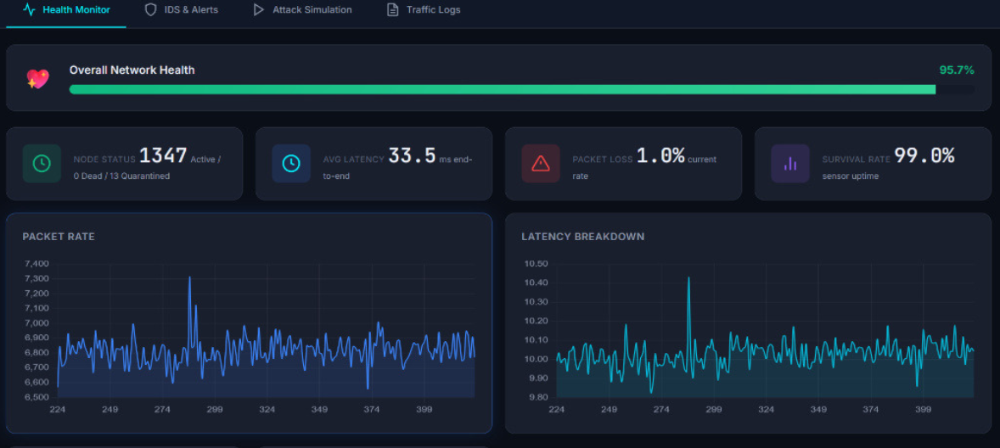
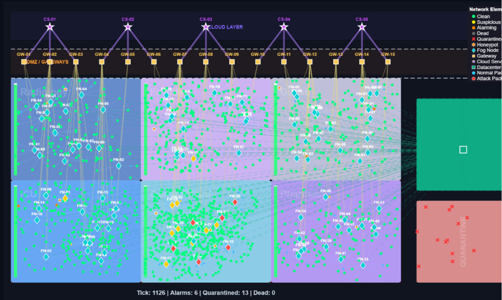
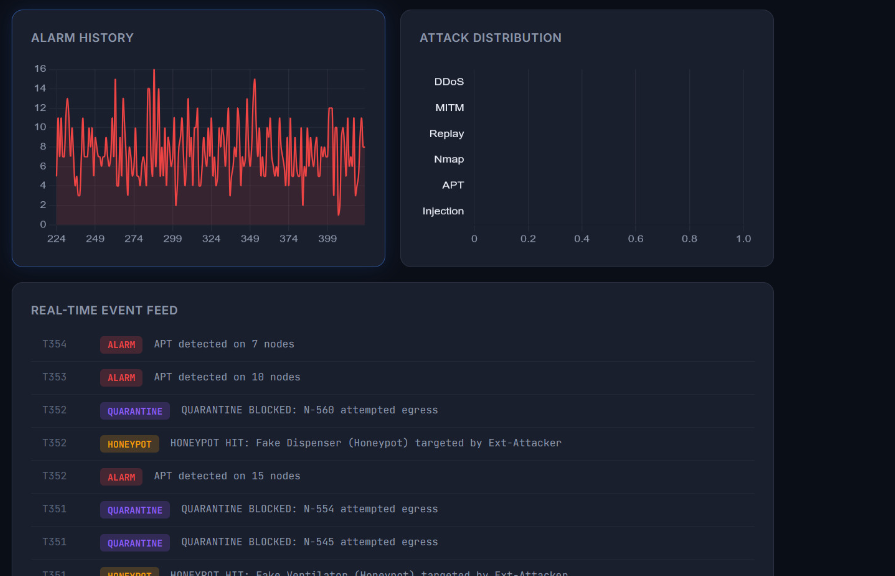
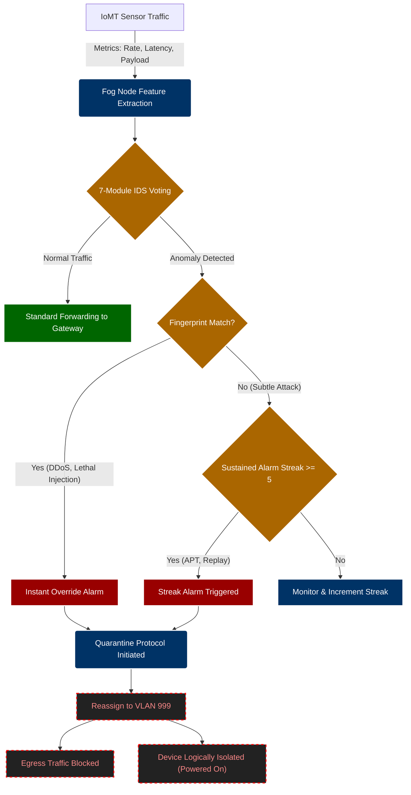
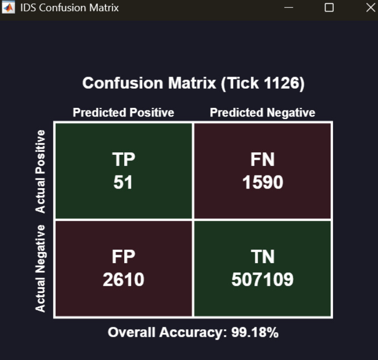

# Hospital Fog Intrusion Detection System (IDS)

  
   
  <em>Real-time network monitoring and analysis dashboard</em>

## 1. Abstract & Overview

The rapid proliferation of Internet of Medical Things (IoMT) devices in modern healthcare environments introduces significant cybersecurity vulnerabilities. This project presents a comprehensive, real-time Intrusion Detection System (IDS) designed specifically for a simulated 1,481-node hospital fog network. 

By leveraging a dual-stack architecture comprising a MATLAB-based high-performance simulation engine and a Python/Flask web dashboard, the system effectively models complex medical device interactions across segmented VLANs. The core of the IDS relies on a lightweight, 7-module statistical machine learning ensemble deployed at the fog layer. This ensemble analyzes packet rates, communication latency, payload entropy, and physiological data integrity to detect various cyber threats, including DDoS, Man-in-the-Middle (MITM), Replay Attacks, Nmap (Port Scanning), Advanced Persistent Threats (APT), and Data Injection.

## 2. Simulating a Real-World Hospital Scale

Modern hospitals rely heavily on interconnected medical devices to provide continuous, life-saving care. The simulation accurately models a large-scale hospital environment spread across a **5-acre facility (500m × 400m)**, bringing true spatial realism to network behavior.

  
   
  <em>1,481-node network topology visualization mapped across 6 clinical zones</em>

* **Massive Scale**: The environment consists of exactly **1,481 network nodes**:
  * 1,360 Edge/Sensor Nodes (IoMT devices)
  * 100 Fog Computing Nodes (Cluster heads)
  * 15 Gateways
  * 5 Cloud Servers and 1 Datacenter
* **Segmented Clinical Zones**: Devices are physically and logically split across 6 distinct clinical zones, each simulating realistic traffic patterns:
  * **Intensive Care Unit (ICU)**: 240 nodes (Ventilators and Patient Monitors producing continuous high-frequency traffic)
  * **General Wards**: 480 nodes (Periodic vital sign checking)
  * **Radiology**: 120 nodes (PACS systems producing high bandwidth, bursty traffic)
  * **Pharmacy**: 120 nodes
  * **Facilities (HVAC/Power)**: 240 nodes
  * **Guest/Public Wi-Fi**: 160 nodes (Low trust zone)
* **Physiological Payloads**: Patient-connected devices generate realistic, randomized physiological vital signs (Heart Rate, SpO2, Blood Pressure, Temperature) to test data integrity attacks.

## 3. Critical Infrastructure & Network Architecture

Hospitals cannot simply "shut down" when compromised. The network architecture in this simulation is built around high uptime and resilience.

### Hierarchical Routing & Fog Computing
By pushing processing and machine learning analytics closer to the edge devices (into the "Fog"), the system achieves real-time threat detection without overwhelming the central cloud. The routing follows a 4-tier model: Sensor $\rightarrow$ Fog Node (using LEACH clustering) $\rightarrow$ Gateway $\rightarrow$ Cloud.

### Strict VLAN Segmentation
The network relies on strict VLAN enforcement and Access Control Lists (ACLs) to isolate critical systems:
* **VLANs 101-106**: Dedicated clinical and operational zones.
* **VLAN 10 (DMZ)**: For public-facing IT services.
* **VLAN 200, 300, 400**: For Fog, Gateway, and Cloud infrastructure.
If a device in the Guest network is compromised by ransomware, the VLAN ACLs physically prevent lateral movement into the ICU's ventilator network.

## 4. The 7-Module Machine Learning IDS

Given the computational constraints of fog nodes, heavy deep neural networks are impractical. Instead, the project utilizes an ensemble of lightweight, unsupervised statistical machine learning models working continuously in real-time.

  
   
  <em>Live event feed and attack distribution monitoring</em>

1. **Unsupervised Baseline Learning (Warm-up)**: The algorithms observe nominal traffic to dynamically calculate normal operational baselines ($\mu$) and standard deviations ($\sigma$) for *every single node* in the network.
2. **Exponentially Weighted Moving Average (EWMA)**: Provides an adaptive baseline for packet rates and latency, allowing the IDS to adapt to legitimate, gradual changes while catching sudden spikes.
3. **Z-Score Anomaly Detection**: Normalizes deviations from the dynamic mean, triggering an anomaly if a threshold is breached.
4. **Cumulative Sum (CUSUM) Change-Point Detection**: Excels at detecting "low and slow" attacks (like APTs) that maintain packet rates just below instant Z-score thresholds.
5. **Shannon Entropy Analysis**: Detects encrypted or randomized data injections by evaluating the statistical distribution of the payload vector, bypassing the need for deep packet inspection.

No single model has absolute authority. Each module casts a binary vote, and the system aggregates these votes to calculate a final normalized Anomaly Score.

## 5. Threat Models & Detection Methodology

The system evaluates network metrics against deterministic fingerprints and statistical voting to detect 6 primary cyber threats:

* **DDoS (Volumetric Floods)**: Detected via an unambiguous traffic footprint where packet rates and latency spike massively. Triggers an immediate override alarm.
* **Nmap (Port Scanning)**: Causes unnatural bursts in transmission without reaching DDoS levels. Caught by combining elevated traffic thresholds with multiple statistical module votes.
* **Replay Attacks**: Attackers maliciously resend historical data streams, causing localized network congestion, caught similarly to scanning behaviors.
* **MITM (Man-in-the-Middle)**: An attacker intercepts communication, introducing severe routing delays. Detected primarily via high-latency footprints and payload entropy deviations.
* **Data Injection / Falsification**: Attackers inject life-threatening physiological data. If the payload indicates impossible biological states (e.g., Heart Rate > 300 bpm or SpO2 < 40%) coupled with an anomaly vote, it is instantly flagged.
* **APT (Advanced Persistent Threats)**: "Low and slow" data exfiltration designed to evade immediate fingerprinting. Caught using CUSUM Change-Point Tracking over long temporal sliding windows.

## 6. Threat Mitigation: Dynamic Quarantine & Decoys

Beyond detection, the system implements active defense mechanisms to neutralize threats without disrupting hospital operations.

> [!TIP]
> **Zero-Downtime Security:** In a clinical setting, physically powering down a compromised ventilator could be lethal. The IDS is designed to logically isolate devices while keeping their core functions powered on.

### Detection to Isolation Pipeline

### Dynamic Node Quarantine (VLAN 999)
When the IDS confirms a compromised node, it employs the quarantine protocol outlined above to instantly isolate the threat. The node's network traffic is dynamically reassigned to an isolated Access Control List mapped to **VLAN 999**. This completely blocks its egress traffic, neutralizing its ability to harm the broader hospital network.
* **Instant Quarantine**: For severe fingerprint matches (DDoS, lethal Data Injection).
* **Streak-Based Quarantine**: For sustained, persistent alarms over multiple simulation ticks.

### Honeypot Decoys
To proactively identify scanning activities, a subset of nodes are designated as 'Honeypots' and strategically placed within the DMZ/LAN. These devices are devoid of medical functionality. Any interaction with them (e.g., an Nmap scan) instantly flags and logs the source as a malicious actor.

## 7. Performance Evaluation & Metrics

At the conclusion of the simulation, the system aggregates the historical node states to compute standard classification metrics, providing a comprehensive evaluation of the IDS.

  
   
  <em>Live statistical performance tracking and detection accuracy</em>

* **Confusion Matrix Calculation**: The system compares the actual ground truth of attacked nodes against the IDS alarms to calculate True Positives (TP), False Positives (FP), True Negatives (TN), and False Negatives (FN).
* **Derived Metrics**: Calculates Accuracy, Detection Rate (Recall), False Positive Rate (FPR), Precision, and the Matthews Correlation Coefficient (MCC).
* **Latency Tracking**: Measures "Detection Latency"—the delta between when an attack was launched and when the IDS first cast an alarm.
* **Survivability**: Evaluates energy depletion to calculate the final network survival rate.

---
*Developed by Mihir Katoch as part of the Fog Computing Course.*
